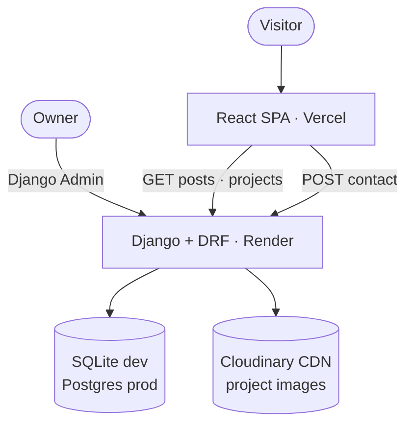

<div align="center">

# 🏗️ Portfolio Architecture

_Design doc for [My-Portfolio-Ronak-2.0](https://github.com/ronakmaniya/My-Portfolio-Ronak-2.0) —
how the portfolio, blog, projects, and contact systems fit together._

**[✨ Live Demo](https://ronak-maniya.vercel.app/) · [🏠 Root README](./README.md) · [🎨 Frontend](./frontend/README.md) · [⚙️ Backend](./backend/README.md)**

</div>

---

## 🎯 Goal

A developer portfolio with an integrated blog, built from scratch:

- **Frontend** — React 19 + Vite SPA (`/`, `/about`, `/projects`, `/blog`, `/blog/:slug`, `/contact`)
- **Backend** — Django 6 + DRF API (`/api/posts/`, `/api/projects/`, `/api/contact/`)
- **Database** — SQLite locally, PostgreSQL in prod via `DATABASE_URL`
- **CMS** — Django Admin only; no custom admin panel

## 🔀 System overview



| Decision | Rationale |
|---|---|
| Separate `blog` / `contact` / `projects` apps | Each domain owns models → serializers → views → admin |
| Public reads, `IsAdminUser` writes | Portfolio is public; only staff mutate or read the inbox |
| Cloudinary for media, API returns `image_url` | No media volume needed on Render; CDN URLs drop into `` |
| JSON for static copy, DB+API for dynamic | Copy edits never need a backend deploy, and vice versa |

## 📦 Content strategy

**Static** (`frontend/src/data/siteData.json`) — hero, skills, experience, social.
Edit JSON, rebuild frontend. No backend involved.

**Dynamic** (database → API → Admin) — blog posts, projects, contact inbox.
Edit in Admin, frontend picks it up. Never hardcode these in JSX.

Fallback entries in `siteData.json` mirror the API shape (`image_url`, `slug`, `excerpt`)
so the same components render live and offline data.

## 📁 Structure

```text
frontend/src/ → pages/ · components/ · services/api.js · data/siteData.json
backend/      → core/ (settings, urls) · blog/ · projects/ · contact/
```

```
/ → landing · /admin/ → Admin · /api/posts/ · /api/projects/ · /api/contact/
```

## 🔌 API contracts

```text
GET /api/posts/                  → { categories: [{ name, slug, posts: [{ title, slug, excerpt, created_at }] }] }
GET /api/posts/<slug>/           → { title, slug, excerpt, content (Markdown), created_at, category }
GET /api/projects/               → [{ title, tag, description, tech_stack, links, image_url, featured, display_order }]
POST /api/projects/              → admin only
POST /api/contact/               → { name, email, message } → 201
GET /api/contact/submissions/    → admin only
```

Blog reads are published-only, newest first (`prefetch_related` / `select_related`);
projects order by `display_order`, then newest. Full examples → [backend README](./backend/README.md#api-reference).

## 🗃️ Data model

```text
Category (name, slug) ──< Post (title, slug, excerpt→auto, content, is_published, timestamps)
Project (title, tag, description, tech_stack[], links, image→Cloudinary, featured, display_order)
ContactMessage (name, email, message, created_at) — newest-first inbox
```

## 🖥️ Frontend notes

- `services/api.js` is the only HTTP layer (base URL + fallback flag + 4 helpers)
- Theme via `data-theme` + `localStorage`, initialized from OS preference
- Every API section: **live → fallback** (if enabled) **→ inline error**
- Tailwind v4 tokens + shared `.btn` / `.card` / `.markdown-content` styles

## ☁️ Deployment

```text
Vercel: frontend/ · npm run build → dist/ · vercel.json SPA rewrite · VITE_API_BASE_URL = prod backend
Render: backend/  · bash build.sh → gunicorn core.wsgi · DEBUG=false · DATABASE_URL · Cloudinary vars
```

## ✅ Non-goals & success criteria

Don't: hardcode dynamic content · mix JSON/API shapes · build a custom admin · add JWT (session + `IsAdminUser` suffices).

Done when: static sections render without a backend · `/blog` groups by category · `/projects`
shows ordered Cloudinary images · `/contact` persists to the Admin inbox · theme persists ·
no broken routes · prod is CORS-clean with staff-gated writes.
