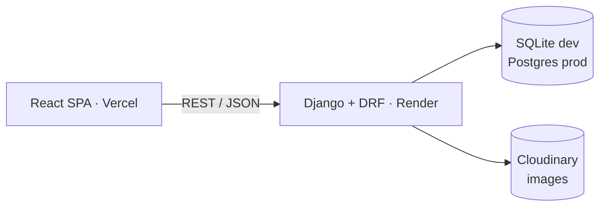

<div align="center">

# Ronak Maniya — Full-Stack Portfolio + Blog

_A production portfolio with an integrated blog, dynamic projects showcase, and contact pipeline._

[](https://ronak-maniya.vercel.app/)
[](https://my-portfolio-ronak-2-0-backend.onrender.com/)


**[✨ Live Demo](https://ronak-maniya.vercel.app/) · [🏗️ Architecture](./Portfolio_Architecture.md) · [🎨 Frontend](./frontend/README.md) · [⚙️ Backend](./backend/README.md)**

</div>

---

## ✨ Features

- 🖥️ **Portfolio pages** — Home, About, Projects, Blog, Contact + 404, responsive with light/dark theme
- 📝 **Category blog** — grouped posts, slug URLs, Markdown rendering
- 🚀 **Dynamic projects** — API-driven, ordered/featured, Cloudinary images
- 📬 **Contact pipeline** — validated form saved to DB, reviewed in Django Admin
- 🔀 **Hybrid content** — static JSON for stable copy, API for posts/projects/messages
- 📴 **Offline-tolerant UI** — optional fallback to local JSON when the API is down
- 🔒 **Prod-hardened** — CORS/CSRF allowlists, secure cookies, JSON-only API, TLS redirect

## 🗺️ Explore

| | |
|---|---|
| 🏠 Portfolio | https://ronak-maniya.vercel.app/ |
| 📝 Blog | https://ronak-maniya.vercel.app/blog |
| 🚀 Projects | https://ronak-maniya.vercel.app/projects |
| 📬 Contact | https://ronak-maniya.vercel.app/contact |
| ⚙️ API root | https://my-portfolio-ronak-2-0-backend.onrender.com/ |
| 🔑 Admin | https://my-portfolio-ronak-2-0-backend.onrender.com/admin/ |

> The earlier static HTML/CSS/JS portfolio lives on at
> [ronakmaniya/My-Portfolio-Ronak](https://github.com/ronakmaniya/My-Portfolio-Ronak).

## 🏗️ How it works



- **Separate Django apps** (`blog`, `contact`, `projects`) + thin `core` package
- **Read-open, write-closed** — public reads, staff-only writes via `IsAdminUser`
- **Django Admin is the CMS** — no custom admin panel
- **One API layer** (`services/api.js`); static copy lives in `siteData.json`

Full design → [`Portfolio_Architecture.md`](./Portfolio_Architecture.md)

## 🚀 Quickstart

Requires **Node 18+** and **Python 3.11+**. Full env reference lives in the
[frontend](./frontend/README.md#environment-variables) and
[backend](./backend/README.md#environment-variables) docs.

```powershell
# Backend → http://127.0.0.1:8000
python -m venv .venv
.\.venv\Scripts\python -m pip install -r backend\requirements.txt
cd backend
Copy-Item .env.example .env   # fill in values, then:
..\.venv\Scripts\python manage.py migrate
..\.venv\Scripts\python manage.py createsuperuser
..\.venv\Scripts\python manage.py runserver
```

```bash
# Frontend → http://localhost:5173
cd frontend && cp .env.example .env && npm install && npm run dev
```

## 📁 Structure

```text
├── README.md                  ← you are here
├── Portfolio_Architecture.md  ← system design & API contracts
├── frontend/                  ← React + Vite SPA (pages, components, api.js, siteData.json)
└── backend/                   ← Django + DRF (blog, projects, contact, core)
```

## 🔌 API at a glance

| Method & path | Access |
|---|---|
| `GET /api/posts/` · `GET /api/posts/<slug>/` | Public |
| `GET /api/projects/` | Public |
| `POST /api/projects/` | Admin only |
| `POST /api/contact/` | Public |
| `GET /api/contact/submissions/` | Admin only |

Prod base: `https://my-portfolio-ronak-2-0-backend.onrender.com/api` ·
Details + examples → [backend README](./backend/README.md#api-reference)

## ☁️ Deploy

- **Frontend (Vercel):** root `frontend/`, build `npm run build`, output `dist/`, SPA rewrite via `vercel.json`
- **Backend (Render):** build `bash build.sh`, start `gunicorn core.wsgi`, one-time `createsuperuser`
- Set `VITE_API_BASE_URL` to the prod backend; set `DEBUG=false` + real secret + `DATABASE_URL` on the backend

<details>
<summary><strong>🔧 Troubleshooting</strong></summary>

| Symptom | Fix |
|---|---|
| Empty sections / fallback showing | Check `VITE_API_BASE_URL`; Render free tier cold-starts — retry |
| CORS error on contact POST | Add exact frontend origin to `DJANGO_CORS_ALLOWED_ORIGINS` + `DJANGO_CSRF_TRUSTED_ORIGINS` |
| `DisallowedHost` (400) | Add backend host to `DJANGO_ALLOWED_HOSTS` |
| `DJANGO_SECRET_KEY must be set` | Set a real secret when `DEBUG=false` |
| `image_url: ""` | Cloudinary vars missing, or project saved without an image |

</details>

## 📬 Contact

Built by **Ronak Maniya** — [GitHub](https://github.com/ronakmaniya) ·
[LinkedIn](https://www.linkedin.com/in/ronak-maniya/) ·
[ronakmaniya2005@gmail.com](mailto:ronakmaniya2005@gmail.com)

_Personal portfolio project — feel free to fork for inspiration._
